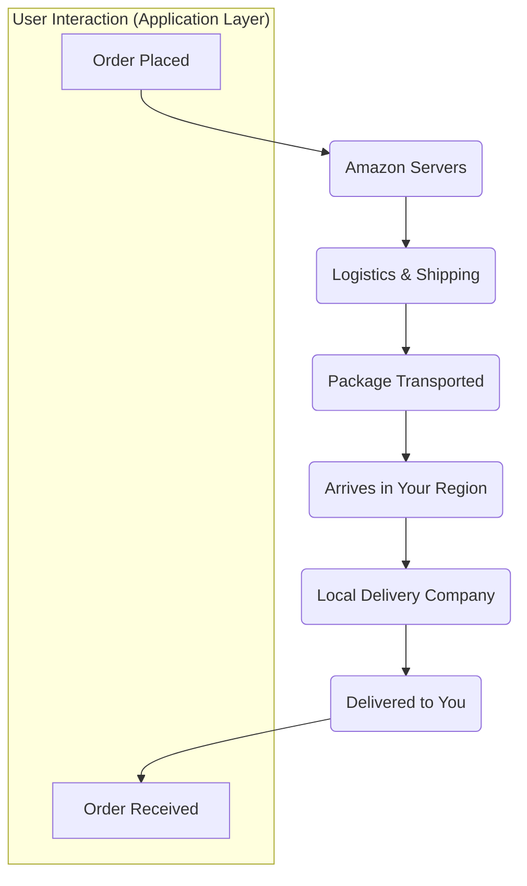

```markdown
# The Digital Journey: A Deep Dive into the OSI Model

When you place an order on Amazon, you are kicking off a complex, high-speed journey for your data. What appears to be a single click is actually a multi-step process managed by a foundational framework in networking: the **OSI (Open Systems Interconnection) Model**. This model is not just theoretical; it's a critical concept for understanding how the internet works and is a **very important topic for technical interviews**.

### The High-Level Flow: An Amazon Order

Let's visualize the journey. Your interaction is only at the beginning and the end, which represents the **Application Layer**.



To get from "Order Placed" to "Amazon Servers," your data travels down 7 distinct layers on your computer. Let's break down each step of this process, known as **encapsulation**.

---

## The 7 Layers of the OSI Model

### Layer 7: Application Layer
This is the layer closest to the user. It doesn't refer to the applications themselves (like Chrome or Outlook), but rather the protocols that these applications use to communicate with the network.

*   **Primary Function:** To provide network services directly to the end-user's application. It's the interface between the software on a machine and the network itself.
*   **How it Works:** When you click "submit" on a web form, your browser (the application) uses a protocol like **HTTPS** (Hypertext Transfer Protocol Secure) to **send that message from this layer down to the Presentation Layer**. Other protocols at this layer include FTP (File Transfer), SMTP (Email), and DNS (Domain Name System).
*   **In short:** This layer is **implemented in software** (like browsers, Chrome, etc.) and is where the human-computer interaction for networking begins.

### Layer 6: Presentation Layer
This layer acts as the network's universal translator and security officer. Its main job is to **get data from the Application Layer** and prepare it for transmission, ensuring the receiving computer can understand it.

*   **Primary Function:** Data translation, encryption, and compression.
*   **Key Responsibilities:**
    *   **Translation:** It takes data from the application and **converts it into a standard, machine-representable binary format**. For example, it might translate character encoding from **ASCII to EBCDIC** to ensure compatibility between the sender and receiver. This process is called **translation**.
    *   **Encryption & Decryption:** This is critical for security. For **encryption and decryption, the SSL protocol is used** (or its modern successor, TLS). This scrambles sensitive data, making it unreadable to eavesdroppers.
    *   **Compression:** It can also compress data to reduce the amount of bandwidth needed for transmission, making the process faster.

### Layer 5: Session Layer
This layer is the dialogue controller. It is responsible for creating, managing, and terminating the connection—or "session"—between two devices.

*   **Primary Function:** To manage the communication session between two computers after it **gets data from the Presentation Layer**.
*   **Key Responsibilities:**
    *   **Session Management:** It **helps in setting up, managing connections, and the termination of the connected session**. When you log into your bank account, the Session Layer establishes a secure session that stays open.
    *   **Authentication & Authorization:** It plays a crucial role in the initial handshake. **Authentication** is the process of verifying you are who you say you are (e.g., with a password). **Authorization** is the process of determining if you have permission to access a certain resource.
    *   **Synchronization:** It places checkpoints in the data stream, so if a connection fails, the transmission can resume from the last checkpoint.
*   **Important Note:** The Session Layer **assumes the layers below it will do their work correctly** once it successfully establishes a session.

### Layer 4: Transport Layer
This layer provides the logic for how data will be sent from one point to another. It **gets data from the Session Layer** and breaks it into smaller, manageable chunks.

*   **Primary Function:** End-to-end communication, reliability, and flow control. It has **protocols on how data will be transported**, like **UDP and TCP**.
*   **Key Responsibilities:**
    *   **Segmentation:** The data received from the Session Layer is broken down into smaller pieces called **segments**.
    *   **Addressing and Sequencing:** Every segment is given a **port number** (to identify the application on the destination machine) and a **sequence number** (so the data can be reassembled in the correct order, passed like chunks).
    *   **Error Control:** A **Checksum** is calculated and added to every data segment to figure out if the data received is good or not. **TCP will get feedback** and re-transmit if there's an error. **UDP gives no feedback**.
*   **Output:** This layer **gives many packets** (after adding headers) to the Network Layer below.

### Layer 3: Network Layer
This layer is responsible for the "big picture" journey of your data across multiple networks. This is where routing decisions are made. **The router lives here.**

*   **Primary Function:** It **works for the transmission of received data segments from one computer to another that is located in a different network**.
*   **Key Responsibilities:**
    *   **Logical Addressing:** A core function of this layer is **logical addressing**. It takes the segments from the Transport Layer and adds the source and destination **IP addresses**, assigning them to **form IP packets to reach the destination**.
    *   **Routing:** Routers operate at this layer to examine the destination IP address of a packet and determine the best physical path for it to travel across the internet.
    *   **Load Balancing:** This also **happens here**. If one route on the internet is congested, routers can redirect packets through less busy paths to ensure efficient delivery.

### Layer 2: Data Link Layer
While the Network Layer is concerned with the entire journey, the Data Link Layer is focused only on the next immediate hop.

*   **Primary Function:** It **gets the data packet from the Network Layer** (which contains the IP addresses of both sender and receiver) and prepares it for transmission to a directly connected computer.
*   **Key Responsibilities (It does two main things):**
    1.  **Logical Link Control:** Manages the flow and error control for the local link.
    2.  **Physical Addressing:** It adds the **MAC (Media Access Control) addresses** of both the sender and the immediate next receiver to the data packet. A MAC address is a unique, **12-digit alphanumeric number** of the network interface of your computer. This creates a "frame."

### Layer 1: The Physical Layer
This is the **hardware section** of the network, consisting of **wires, etc.** It's where digital data becomes a physical signal.

*   **Primary Function:** To transmit raw binary data (bits) over a physical medium.
*   **How it Works:** The data from the layers above will be in the **form of 0s and 1s**. This layer **converts these bits into physical signals** that can travel over wires, fiber optics, or local media like **radio signals**.

---

### The Journey in Reverse: De-encapsulation

After your data travels across the internet and reaches its destination (e.g., your friend's computer):

*   The data goes to the **physical router** of your friend.
*   Then, it will **climb back up** the OSI model in reverse order:
    1.  **Physical Layer** receives signals and turns them into bits.
    2.  **Data Link Layer** gets the frame and passes the packet up.
    3.  **Network Layer** gets the packet and passes the segment up.
    4.  **Transport Layer** reassembles the segments.
    5.  ...and so on, until the message appears in your friend's application.
```